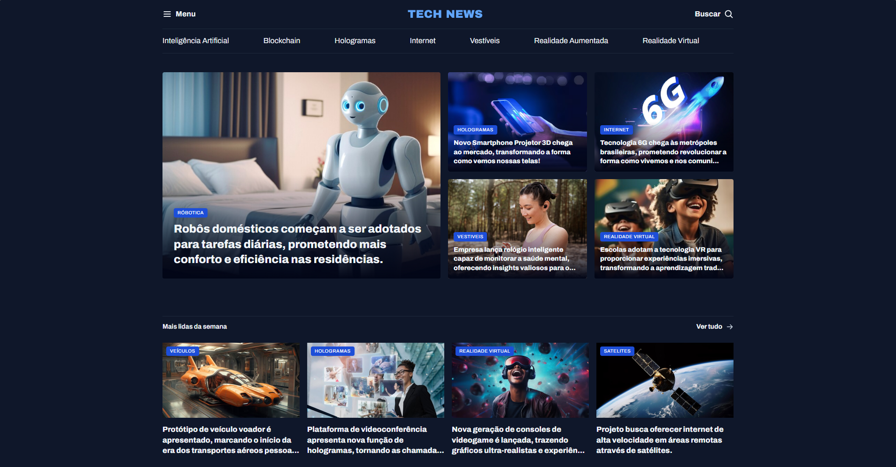

<h1 align="center">
    
</h1>
<p align="center">News Portal. Um aplicativo focado no estudo de estilo, proporcionando uma página visualmente atraente e organizada para exibir notícias de forma clara e moderna.</p>
<p align="center">
 <a href="#sobre-o-projeto">Sobre o Projeto</a> |
 <a href="#tecnologias">Tecnologias</a> |
 <a href="#iniciando-o-projeto">Iniciando o projeto</a> |
 <a href="#licença">Licença</a> |
 <a href="#autor">Autor</a> 
</p>

### Sobre o Projeto

News Portal é uma aplicação simples focada no estudo e aplicação de estilos com HTML e CSS. O objetivo foi criar uma página de notícias organizada, responsiva e visualmente moderna, seguindo boas práticas de design e tipografia para uma experiência de leitura agradável.

---

### Tecnologias

- [HTML5](https://developer.mozilla.org/en-US/docs/Web/Guide/HTML/HTML5) - Linguagem de marcação utilizada para estruturar a página
- [CSS3](https://developer.mozilla.org/en-US/docs/Web/CSS) - Folhas de estilo em cascata utilizadas para estilizar a página

---

### Como Começar

```bash
# Clone o aplicativo
$ git clone https://github.com/sillasemanoel/news-portal

# Navegue até o diretório do aplicativo
$ cd news-portal

# Abra o arquivo index.html no seu navegador
$ index.html
```

---

### Licença

Distribuído sob a Licença MIT. Veja [LICENSE](LICENSE) para mais informações.

---

### Autor

Feito por Sillas Emanoel 👋🏽
